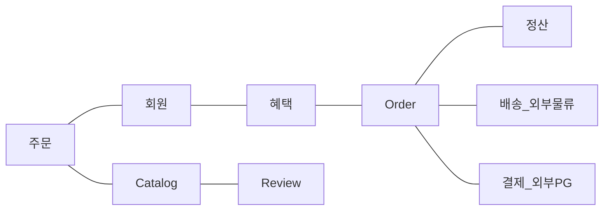

# Domain

SW로 해결하고자 하는 문제 영역(ex: 온라인 서점).

한 Domain은 다시 하위 Domain으로 나눌 수 있다.
- Catalog 하위 Domain은 고객에게 구매할 수 있는 상품 목록을 제공, 주문 하위 Domain은 고객의 Order을 처리.



하위 Domain을 어떻게 구성할지 여부는 상황에 따라 달라진다.

배송, 결제와 같이 소프트웨어가 모든 Domain의 기능을 제공하지는 않는다.

# Domain Model

Domain Model은 특정 Domain을 "개념적"으로 표현한 것이다.

Domain Model을 사용하면 여러 관계자들이 동일한 모습으로 Domain을 이해하고 Domain 지식을 공유하는 데 도움이 된다.

Domain Model은 객체 기반, 상태 Diagram 등 다양한 방식으로 표현 가능하다.


![[00 - Order Domain.jpg]]

Domain 모델은 기본적으로 Domain 자체를 이해하기 위한 개념 모델이다.

개념 모델을 이용해서 바로 코드를 작성할 수 있는 것은 아니기에 구현 기술에 맞는 구현 모델이 따로 필요하다.

# 조직 간 하위 Domain과 Model을 사용한 소통

각 하위 Domain이 다루는 영역은 서로 다르기 때문에 같은 용어라도 하위 Domain마다 의미가 달라질 수 있다.

ex) 상품
- Catalog Domain : 상품 가격 상세 내용을 담고 있는 정보.
- 배송 Domain : 고객에게 실제 배송 되는 물리적인 상품.

Domain 따라 용어의 의미가 결정되므로, 여러 하위 Domain을 하나의 Diagram에 Modeling 하면 안 된다.

# Domain Model Pattern

Architecture 구성
- User Interface or Presentation : 사용자의 요청을 처리하고 사용자(User, External System)에게 정보를 보여준다.
- Application : User가 요청한 기능을 실행. Business Logic을 직접 구현하지 않으며 Domain Layer를 조합해서 기능을 실행.
- Domain : System이 제공할 Domain Rule을 구현.
- Infrastructure : DB Messaging System과 같은 External System과의 연동을 처리.

Domain Layer : Domain의 Core Rule을 구현한다.
- ex) Order Domain의 경우 '출고 전에 배송지를 변경할 수 있다'는 Rule과 Cancel Order는 배송 전에만 할 수 있다.
- ex) 배송지 변경 가능 여부를 판단하는 기능이 Order Class에 있든 OrderState class에 있든 중요한 점은 Order와 관련된 Core Rule은 Order Domain Model인 Order나 OrderState에서 구현한다.


# 개념 Model과 구현 Model

개념 Model : 순수하게 문제를 분석한 결과물. DB, Transaction, Performance등 구현 기술과 같은 것들을 고려하고 있지 않음.

구현 Model : 개념 Model에서 구현 기술을 고려 함.

실제 Code를 작성할 떄 개념 Model을 있는 그대로 사용할 수 없다. 그래서 개념 Model을 구현 가능한 형태의 구현 Model로 전환하는 과정을 거치게 된다.

개념 Model을 만들 때 처음부터 완벽한 Domain을 만드는 것은 불가능에 가깝다. SW를 개발하는 동안 개발자와 관계자들은 해당 Domain을 더 잘 이해하게 되고 Model을 개선하게 된다.

# Domain Model 도출

Domain을 모델링 할 때 기본이 되는 작업은 Model을 구성하는 Core 구성요소, Rule, 기능을 찾는 것이다. 이 과정은 '요구사항'에서 출발한다.
- ex) 요구 사항 : 출고 상태로 변경, 결제 완료로 변경, ...
	- 배송지 정보 변경
	  - Rule : 배송지 정보 필수
	- 주문 취소
	  - Rule : 출고 전에만 가능(제약 사항)

요구 사항을 분석 하면서 Domain Model의 이름을 변경하는 개선을 할 수 있다.
- ex) isShippingChangeable -> verifyNotYetShipped
	- Domain을 더 잘 알게 되었기 떄문에 Domain을 더 잘 표현하는 이름으로 변경
	- 최초에는 배송지 정보 변경에 대한 제약 조건만 파악(isShippingChangeable)
	- 요구사항을 분석하면서 배송지 정보 변경과 주문 취소가 둘 다 출고 전에 가능 하다는 제약 조건을 알게됨(verifyNotYetShipped).

# Domain 구성

Entity : 식별자. Entity를 구현한 클래스는 equals(), hashCode() 메서드등을 구현해서 고유값을 비교, 생성 하기도 한다. 
- ex) orderNumber
- ex) Order에서 배송지 주소가 바뀌거나 상태가 바뀌더라도 주문번호가 바뀌지 않는 것 처럼 Entity의 식별자는 바뀌지 않는다.

Entity의 식별값 생성 : 식별값으로 UUID 많이 사용. 또는 DB의 일련 번호 자동 증가 기능을 사용 하기도 한다 단 DB의 일련 번호 자동 증가 기능은 DB Table에 Data를 추가 해야만 비로소 값을 알 수 있다는 제약 사항이 있다.

Value : 개념적으로 완전한 하나를 표현할 때 사용한다. 원시적인 Data들을 조합하여 복잡한 정보를 Data로 표현하고 연관된 Data들이 하나의 개념을 표현하기 위해 구성 되었다는 것을 표현.
- ex) 받는 사람의 주소, 받는 사람 이름, ...
- ex) 받는 사람 -> class Receiver, 주소 -> class Address
- ex) 배송 -> class ShippingInfo

Value의 장점
- Data 추상화를 통해 변경에 대한 대처를 유연하게 한다
- 코드의 의미를 좀더 부각한다.
	- ex) int price; -> Money price;

비교
- Entity : 식별자를 비교함
- Value : 모든 속성의 값이 같은지 비교함

Entity와 Value의 관계 : Entity는 Value를 사용한다. Entity의 식별자 역시 Value이다.


# Domain Model에 get/set

Domain Model에 get/set method를 무조건 추가하는 것은 좋지 않은 버릇이다. 특히 set method는 Domain의 핵심 개념이나 의도를 코드에서 사라지게 한다.
- ex) Order.setShippingInfo(arg), Order.setOrderState(arg)
	- Domain과 관련된 어떤 의도도 표현되지 않는다.
	- 두 set 대신 completePayment(arg)와 같은 method로 대체하는 것이 Domain과 관련된 의도를 조금더 잘 표현한다.

set method의 또 다른 문제는 Domain 객체를 생성할 떄 완전한 상태가 아닐 수도 있다.

ex) 불완전한 상태를 Domain 객체 생성

```java
Order order = new Order();
order.setOrderLine(lines);
// Orderer를 설정해야 하는데 부주의하게 설정하지 않음
order.setState(OrderState.PREPARING);// 잘못된 설정
```

ex) 개선 : 생성 시점부터 필요한 설정을 할 수 있도록 관련 Data를 받음

```java
Order order = new Order(orderer, lines, OrderState.PREPARING);
```


# Immutable Value Type

Immutable Value Type을 사용하면 자연스럽게 Value Type에는 set method를 구현하지 않는다. set method를 구현해야 할 특별한 이유가 없다면 Immutable 타입의 장점을 살릴 수 있도록 Value Type은 Immutable으로 구현 하는것이 좋다.


# Architecture 역할

Presentation Layer : User의 요청을 해석해서 Application Layer에 전달. Application Layer에 존재하는 Application Service의 실핼 결과를 User가 이해할 수 있는 형식으로 변환해서 응답.
- ex) Spring MVC

Application Layer : 시스템이 사용자에게 제공해야 할 기능을 구현.
- ex) 주문 등록, 주문 취소, 상품 상세 조회

Application Layer는 기능을 구현하기 위해 Domain Layer의 모델을 사용. Application Service는 Logic을 직접 수행하기보다는 Domain Model에 Logic 수행을 위임한다.

![[DDD Architecture Role.png]]

# 고수준, 저수준 DIP


고수준, 저수준, DIP

![[KakaoTalk_20231126_091347775.jpg]]

고수준 모듈
- ex) CalculateDiscountService : "가격 할인 계산"이라는 기능 구현
- 고수준 모듈은 "의미 있는" 단일 기능을 제공하는 모듈.
- 고수준 모듈의 기능을 구현하려면 여러 하위 기능이 필요

저수준 모듈
- ex) JPA 모듈, Drools 모듈
- 하위 기능을 실제로 구현

의존성 문제
- 고수준 모듈이 제대로 동작하려면 저수준 모듈을 사용해야 한다. 
- 고수준 모듈이 저수준 모듈을 사용하면서 두가지 문제가 발생할 수 있다.
	- 구현 변경 어려움
	- 테스트 어려움

문제를 해결하기 위해 저수준 모듈이 고수준 모듈에 의존하도록 바꾼다.
- 추상화한 인터페이스 사용

![[DDD Architecture Dependency.png]]


DIP 주의사항
- DIP의 핵심은 고수준 모듈이 저수준 모듈에 의존하지 않도록 하는 것이다.
- 인터페이스로 추출 하였다고 고수준 모듈과 저수준 모듈 의존성을 제거한 것이 아니다.
- ex) 잘못된 구조
	- ![[KakaoTalk_20231126_094148130.jpg]]
	- 인터페이스로 추출 하였지만 여전히 도메인 계층이 인프라 계층에 의존하고 있따.
	- CalculateDiscountService 입장에서 봤을 때 할인 금액을 구하기 위해 룰 엔진을 사용하는지, 직접 연산하는지 여부는 중요하지 않다. 단지 규칙에 따라 할인 금액을 계산한다는 것이 중요할 뿐이다.
- (i) RuleDiscounter : 할인 금액 계산 역할을 표현하는 인터페이스 -> 고수준 모듈
- (i) RuleEngine : 룰엔진 역할을 표현하는 인터페이스 -> 저수준 모듈

# Architecture DIP

![[인프라 DIP 적용.png]]


인프라에 위치란 클래스가 도메인이나 응용 영역에 정의한 인터페이스를 상속받아 구현하는 구조가 되므로 도메인과 응용 영역에 대한 영향을 주지 않거나 최소화하면서 구현 기술을 변경하는 것이 가능하다.

ex) 구현 기술 변경
- before
	- ![[KakaoTalk_20231126_104545045.jpg]]
- after
	- ![[KakaoTalk_20231126_104916134.jpg]]

